# IntelliFind — Intelligent Lost & Found Matching System

> A pure Java SE command-line application for intelligent campus lost-and-found management using multi-dimensional similarity matching.

**Developed by:** Nilesh Dwivedi

**Registration Number:** 24BCY10095

---

## 📌 Overview

**IntelliFind** is a Java SE command-line application designed to improve campus lost-and-found management through intelligent similarity matching.

Instead of requiring users to manually compare every lost and found record, IntelliFind compares multiple attributes, calculates weighted similarity scores, ranks potential matches, and provides an explainable breakdown for human verification.

The system is designed to be:

* **Explainable**
* **Modular**
* **Persistent**
* **Algorithm-driven**
* **Command-line based**
* **Independent of external APIs and third-party libraries**

### Application Preview

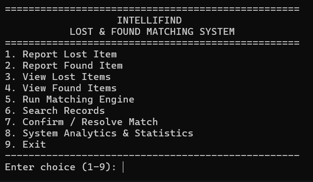

---

## 📑 Table of Contents

* [Overview](#-overview)
* [Objectives](#-objectives)
* [Key Features](#-key-features)

   * [Lost Item Reporting](#1-lost-item-reporting)
   * [Found Item Reporting](#2-found-item-reporting)
   * [Multi-Dimensional Matching](#3-multi-dimensional-matching)
   * [Bidirectional Match Detection](#4-bidirectional-match-detection)
   * [Explainable Match Results](#5-explainable-match-results)
   * [Manual Match Evaluation](#6-manual-match-evaluation)
   * [Match Confirmation and Resolution](#7-match-confirmation-and-resolution)
   * [Attribute Search](#8-attribute-search)
   * [Analytics and Reporting](#9-analytics-and-reporting)
* [How It Works](#-how-it-works)
* [Example Workflow](#-example-workflow)
* [System Architecture](#-system-architecture)
* [Component Overview](#-component-overview)
* [Similarity Scoring Engine](#-similarity-scoring-engine)
* [Project Directory Structure](#-project-directory-structure)
* [Prerequisites](#-prerequisites)
* [Build and Execution Guide](#-build-and-execution-guide)
* [Persistence and Storage](#-persistence-and-storage)
* [Input Validation and Error Handling](#-input-validation-and-error-handling)
* [Design Goals](#-design-goals)
* [Java Concepts Demonstrated](#-java-concepts-demonstrated)
* [Evaluation Checklist](#-evaluation-checklist)
* [Data Model](#-data-model)
* [Future Enhancements](#-future-enhancements)
* [Original Algorithmic Implementation](#-original-algorithmic-implementation)
* [Conclusion](#-conclusion)

---

# 🎯 Objectives

The primary objectives of IntelliFind are:

1. Automate comparison between lost and found item records.
2. Reduce repetitive manual searching.
3. Produce ranked potential matches instead of a simple yes/no result.
4. Make matching decisions explainable through individual similarity scores.
5. Maintain persistent records using local CSV files.
6. Provide a command-line interface requiring no graphical environment.
7. Demonstrate practical Java programming and algorithmic concepts.

### Concepts Demonstrated

The project demonstrates:

* Object-oriented programming
* Encapsulation
* Inheritance
* Abstraction
* Polymorphism
* Enumerations
* Collections
* Streams
* File I/O
* Exception handling
* Date/time APIs
* String processing
* Modular architecture
* Algorithmic similarity matching

---

# 🚀 Key Features

## 1. Lost Item Reporting

Users can register a lost item by providing:

* Category
* Brand
* Model
* Color
* Location
* Date
* Description
* Contact information

Each lost record receives a generated identifier such as:

```text
L-101
```

### Match Confidence Example

```text
╔════════════════════════════════════════════════════════╗
║              MATCH CONFIDENCE EXPLANATION              ║
╠════════════════════════════════════════════════════════╣
║ Lost: L-101            Found: F-087                    ║
║ Score:  94.2%                                          ║
║────────────────────────────────────────────────────────║
║ ✔ Category      100.0%                                 ║
║ ✔ Brand         100.0%                                 ║
║ ✔ Model         100.0%                                 ║
║ ✔ Color         100.0%                                 ║
║ ✔ Location       85.0%                                 ║
║ ✔ Date          100.0%                                 ║
║ ✔ Description    78.0%                                 ║
╚════════════════════════════════════════════════════════╝
```

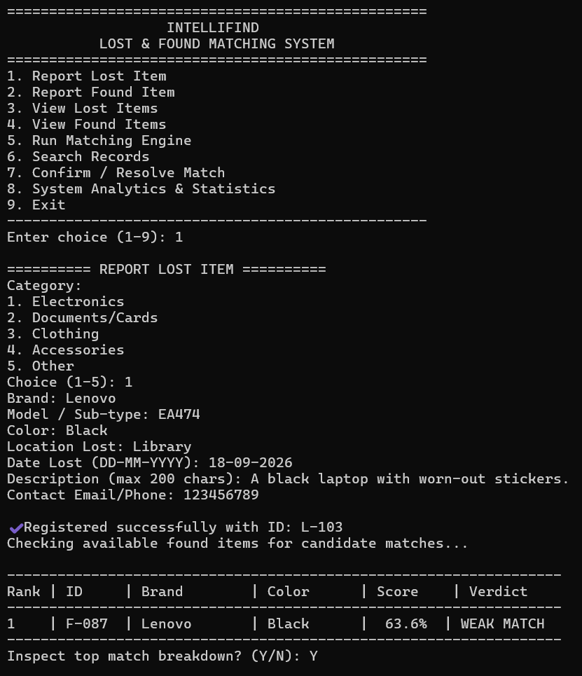

---

## 2. Found Item Reporting

Users can report a found item using:

* Category
* Brand
* Model
* Color
* Location
* Date
* Description
* Storage/custody location

Found records receive identifiers such as:

```text
F-087
```

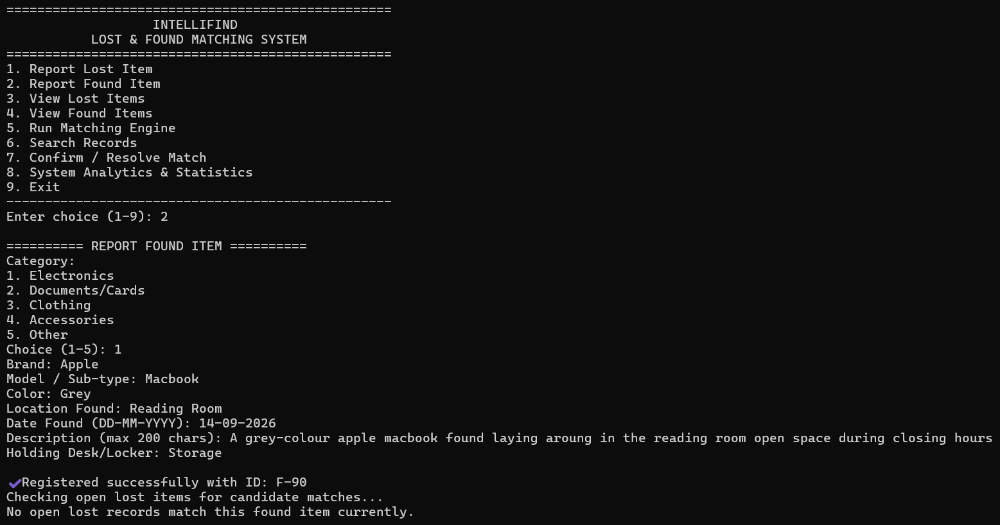

---

## 3. Multi-Dimensional Matching

IntelliFind compares lost and found records across seven dimensions:

| Dimension   |
| ----------- |
| Category    |
| Brand       |
| Model       |
| Color       |
| Location    |
| Date        |
| Description |

The resulting weighted score is used to rank potential matches.

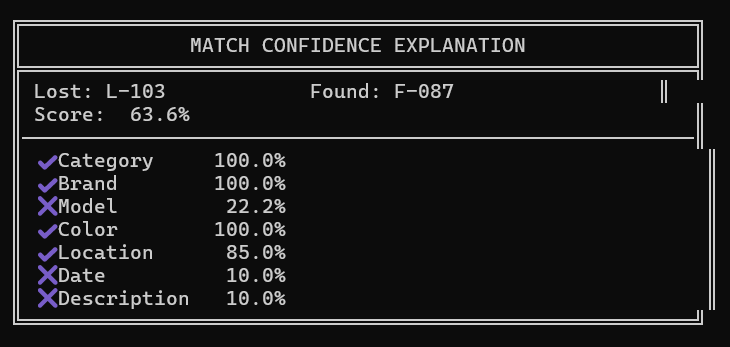

---

## 4. Bidirectional Match Detection

Matching is evaluated whenever a new record is submitted, regardless of which side is entered first.

### Lost Item Submitted

```text
New Lost Item
      │
      ▼
Compare with existing Found Items
      │
      ▼
Calculate Scores
      │
      ▼
Rank Matches
```

### Found Item Submitted

```text
New Found Item
      │
      ▼
Compare with existing Lost Items
      │
      ▼
Calculate Scores
      │
      ▼
Rank Matches
```

This allows the matching system to work regardless of whether the lost record or found record is entered first.

---

## 5. Explainable Match Results

Instead of producing only an opaque percentage, IntelliFind displays the breakdown of individual matching dimensions.

```text
╔════════════════════════════════════════════════════════╗
║              MATCH CONFIDENCE EXPLANATION             ║
╠════════════════════════════════════════════════════════╣
║ Lost: L-101             Found: F-087                   ║
║ Score: 94.2%                                          ║
║────────────────────────────────────────────────────────║
║ ✔ Category      100.0%                                ║
║ ✔ Brand         100.0%                                ║
║ ✔ Model         100.0%                                ║
║ ✔ Color         100.0%                                ║
║ ✔ Location       85.0%                                ║
║ ✔ Date          100.0%                                ║
║ ✔ Description    78.0%                                ║
╚════════════════════════════════════════════════════════╝
```

This allows users to understand **why** two records were considered similar.

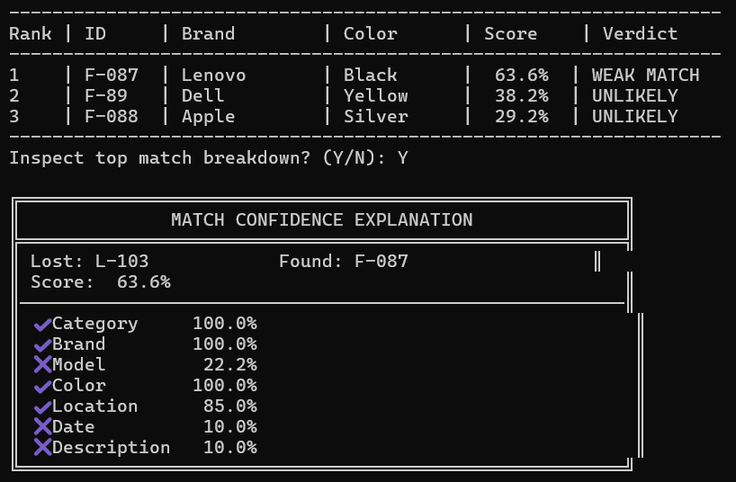

---

## 6. Manual Match Evaluation

Users can inspect open lost items at any time and run a comparison against all available found records on demand.

Potential matches are:

1. Calculated
2. Ranked
3. Displayed for inspection

This gives users control over when and how potential matches are evaluated.

---

## 7. Match Confirmation and Resolution

Potential matches require human verification.

A user can inspect the candidate pair and explicitly confirm the link.

Once confirmed:

```text
Lost Item  (L-101) ──► Status: MATCHED
Found Item (F-087) ──► Status: MATCHED
```

This prevents the matching algorithm from automatically resolving records without user confirmation.

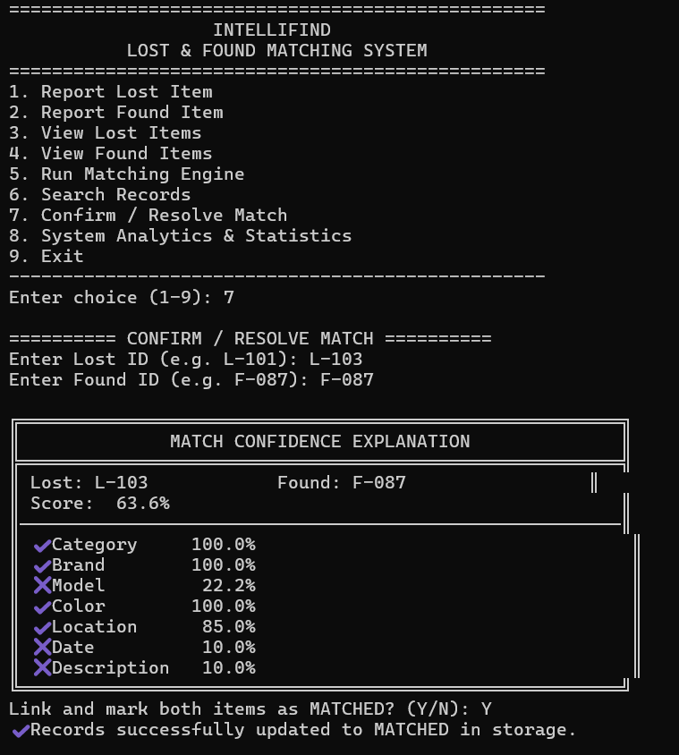

---

## 8. Attribute Search

Users can search existing records using:

* Category
* Brand
* Description keywords

Search results can be used to quickly locate relevant lost or found records.

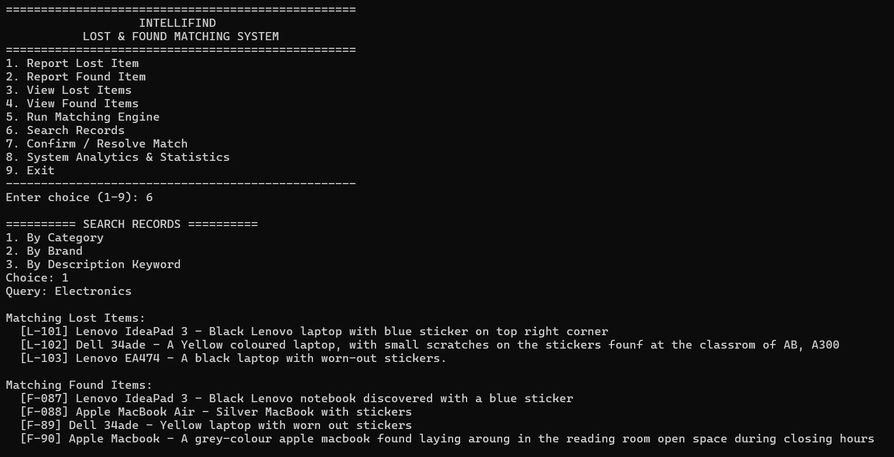

---

## 9. Analytics and Reporting

The system provides live operational metrics such as:

* Total registered lost items
* Total registered found items
* Confirmed matched records
* Open/unresolved lost items
* Open/unresolved found items
* Category distribution
* Resolution rate

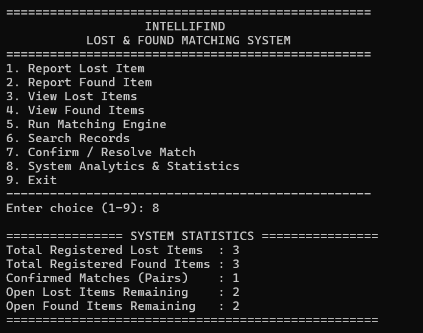

---

# ⚙️ How It Works

The overall IntelliFind workflow is:

```text
                 ┌───────────────────┐
                 │   User Reports    │
                 └─────────┬─────────┘
                           │
                           ▼
                 ┌───────────────────┐
                 │  Validate Input   │
                 └─────────┬─────────┘
                           │
                           ▼
                 ┌───────────────────┐
                 │  Store Item Record│
                 └─────────┬─────────┘
                           │
                           ▼
                 ┌───────────────────┐
                 │  Matching Engine  │
                 └─────────┬─────────┘
                           │
                ┌──────────┼──────────┐
                ▼          ▼          ▼
           Category      Text      Location
           Matching    Similarity   Matching
                │          │          │
                └──────────┼──────────┘
                           │
                           ▼
                 ┌───────────────────┐
                 │  Weighted Score   │
                 └─────────┬─────────┘
                           │
                           ▼
                 ┌───────────────────┐
                 │  Ranked Matches   │
                 └─────────┬─────────┘
                           │
                           ▼
                 ┌───────────────────┐
                 │ Human Verification│
                 └─────────┬─────────┘
                           │
                           ▼
                 ┌───────────────────┐
                 │ Confirm / Resolve │
                 └───────────────────┘
```

---

# 🔄 Example Workflow

Suppose a student reports:

```text
Lost Item ID: L-101

Category: Electronics
Brand: Lenovo
Model: IdeaPad 3
Color: Black
Location: University Library
Date: 10-09-2026
Description: Black Lenovo laptop with blue sticker on top right corner
```

Later, a campus staff member reports:

```text
Found Item ID: F-087

Category: Electronics
Brand: Lenovo
Model: IdeaPad 3
Color: Black
Location: Library Reading Room
Date: 10-09-2026
Description: Black Lenovo notebook discovered with a blue sticker
```

## System Evaluation

The matching engine evaluates:

| Dimension   | Example Result |
| ----------- | -------------: |
| Category    |           100% |
| Brand       |           100% |
| Model       |           100% |
| Color       |           100% |
| Location    |            85% |
| Date        |           100% |
| Description |            78% |

The records receive a high composite similarity score and `F-087` is presented as a strong candidate for `L-101`.

The user can inspect the individual scores and then manually confirm the match.

---

# 🏗️ System Architecture

IntelliFind uses a modular architecture separating presentation, domain models, matching algorithms, and persistence.

```text
┌───────────────────────────────────────────────────┐
│                Presentation Layer                 │
│                                                   │
│ Main.java                                         │
│ InputValidator.java                               │
└─────────────────────────┬─────────────────────────┘
                          │
                          ▼
┌───────────────────────────────────────────────────┐
│                  Domain Model                     │
│                                                   │
│ Item.java                                         │
│ LostItem.java                                     │
│ FoundItem.java                                    │
│ ItemStatus.java                                   │
│ MatchResult.java                                  │
└─────────────────────────┬─────────────────────────┘
                          │
                          ▼
┌───────────────────────────────────────────────────┐
│            Algorithmic Matching Layer             │
│                                                   │
│ SimilarityEngine.java                             │
│ TextSimilarity.java                               │
│ LocationMatcher.java                              │
│ DateMatcher.java                                  │
└─────────────────────────┬─────────────────────────┘
                          │
                          ▼
┌───────────────────────────────────────────────────┐
│                Data Access Layer                  │
│                                                   │
│ ItemRepository.java                               │
└─────────────────────────┬─────────────────────────┘
                          │
                          ▼
┌───────────────────────────────────────────────────┐
│                 CSV File Storage                  │
│                                                   │
│ data/lost_items.csv                               │
│ data/found_items.csv                              │
└───────────────────────────────────────────────────┘
```

## Mermaid Architecture Diagram

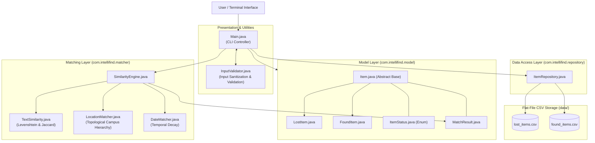

---

# 🧩 Component Overview

## Presentation Layer

### `Main.java`

Responsible for:

* Interactive command-line menu
* Lost item reporting
* Found item reporting
* Search
* Matching workflows
* Match confirmation
* Analytics
* Output formatting

### `InputValidator.java`

Responsible for validating command-line input.

It handles:

* Non-empty strings
* Maximum-length strings
* Date validation
* Integer range validation
* Yes/No confirmations

---

# 🧱 Domain Model

Located in:

```text
src/com/intellifind/model/
```

## `Item.java`

Abstract base class containing common item information:

```text
id
category
brand
model
color
location
date
description
status
```

## `LostItem.java`

Extends `Item` and adds:

```text
contact information
```

## `FoundItem.java`

Extends `Item` and adds:

```text
storage/custody location
```

## `ItemStatus.java`

Enumeration representing the lifecycle of an item:

```text
OPEN
MATCHED
RESOLVED
```

## `MatchResult.java`

Represents the result of comparing a lost item with a found item.

It contains the component similarity scores and overall match score used for ranking.

---

# 🧠 Algorithmic Matching Layer

Located in:

```text
src/com/intellifind/matcher/
```

## `SimilarityEngine.java`

Acts as the central coordinator of the matching process.

It combines the individual similarity measurements using weighted scoring.

---

## `TextSimilarity.java`

Provides text comparison algorithms.

### Jaccard Similarity

Jaccard similarity compares sets of meaningful words:

```text
J(A,B) = |A ∩ B| / |A ∪ B|
```

The implementation can normalize text, remove punctuation, filter common stop words, and compare meaningful tokens.

### Levenshtein Distance

Levenshtein distance measures character-level differences and can be normalized to a similarity score between `0.0` and `1.0`.

---

## `LocationMatcher.java`

Provides hierarchical campus location matching.

For example:

```text
Library
├── Entrance
├── Reading Room
├── Computer Section
└── Security Desk
```

Locations belonging to the same parent area can receive stronger similarity than unrelated locations.

---

## `DateMatcher.java`

Compares the calendar dates associated with lost and found records.

The similarity decreases as the difference between the dates increases.

---

# 📊 Similarity Scoring Engine

The final score is calculated using a weighted sum:

```text
Final Score = Σ (weight × similarity)
```

## Matching Weights

| Dimension   | Weight | Matching Method                   |
| ----------- | -----: | --------------------------------- |
| Category    |    20% | Categorical comparison            |
| Brand       |    15% | Normalized Levenshtein similarity |
| Model       |    15% | Normalized Levenshtein similarity |
| Color       |    10% | Normalized text similarity        |
| Location    |    15% | Hierarchical location matching    |
| Date        |    10% | Calendar-date proximity           |
| Description |    15% | Tokenized Jaccard similarity      |

### Total Weight

```text
20 + 15 + 15 + 10 + 15 + 10 + 15 = 100%
```

---

## Confidence Levels

|                Score | Verdict        |
| -------------------: | -------------- |
|            `>= 0.85` | Strong Match   |
| `>= 0.70 and < 0.85` | Possible Match |
| `>= 0.50 and < 0.70` | Weak Match     |
|             `< 0.50` | Unlikely       |

For display:

```text
0.94 = 94%
```

---

# 📁 Project Directory Structure

```text
IntelliFind/
├── README.md
├── statement.md
├── run.bat
│
├── data/
│   ├── lost_items.csv
│   └── found_items.csv
│
├── src/
│   └── com/
│       └── intellifind/
│           ├── Main.java
│           │
│           ├── model/
│           │   ├── Item.java
│           │   ├── LostItem.java
│           │   ├── FoundItem.java
│           │   ├── ItemStatus.java
│           │   └── MatchResult.java
│           │
│           ├── matcher/
│           │   ├── SimilarityEngine.java
│           │   ├── TextSimilarity.java
│           │   ├── LocationMatcher.java
│           │   └── DateMatcher.java
│           │
│           ├── repository/
│           │   └── ItemRepository.java
│           │
│           └── util/
│               └── InputValidator.java
│
└── test/
```

---

# 🔄 Application State Flow

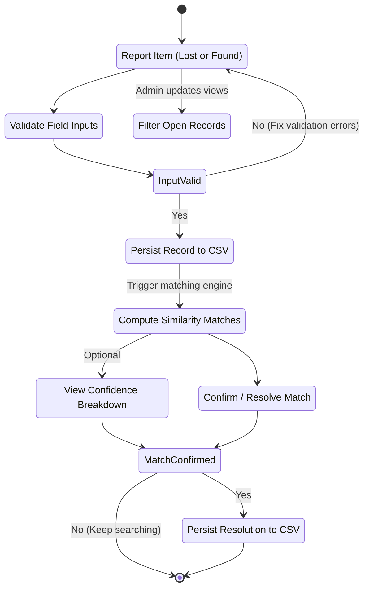

---

# 💻 Prerequisites

* **Java Development Kit (JDK) 17 or higher**
* Windows Command Prompt / PowerShell, macOS Terminal, or Linux Shell
* Git for version control

JDK 21 LTS is also supported.

### Verify Java Installation

```bash
java -version
javac -version
```

---

# ▶️ Build and Execution Guide

> **Important:** Compile and run the application from the project root directory (`IntelliFind/`) so that the relative `data/` storage paths resolve correctly.

## Option 1 — Windows Batch Script

Run:

```cmd
run.bat
```

From PowerShell:

```powershell
.\run.bat
```

The script compiles the project and launches the application.

---

## Option 2 — Manual Windows Compilation

### 1. Create a list of Java source files

```cmd
dir /s /B src\*.java > sources.txt
```

### 2. Compile

```cmd
javac -encoding UTF-8 -d bin @sources.txt
```

### 3. Delete the temporary file

```cmd
del sources.txt
```

### 4. Run

```cmd
java -cp bin com.intellifind.Main
```

---

## Linux / macOS

### 1. Create the output directory

```bash
mkdir -p bin
```

### 2. Compile

```bash
javac -encoding UTF-8 -d bin $(find src -name "*.java")
```

### 3. Run

```bash
java -cp bin com.intellifind.Main
```

---

# 📦 Creating a JAR

Compile the project first, then:

```bash
jar cfe IntelliFind.jar com.intellifind.Main -C bin .
```

Run:

```bash
java -jar IntelliFind.jar
```

> Run the JAR from the project root so that the application's relative `data/` directory remains accessible.

---

# 💾 Persistence and Storage

IntelliFind uses local CSV files for persistent storage.

```text
data/
├── lost_items.csv
└── found_items.csv
```

This avoids requiring an external database and keeps the application easy to run from the command line.

---

## Lost Item Records

A lost record contains fields such as:

```text
ID
Category
Brand
Model
Color
Location
Date
Description
Status
Contact
```

---

## Found Item Records

A found record contains:

```text
ID
Category
Brand
Model
Color
Location
Date
Description
Status
Storage Location
```

---

## CSV Delimiter Handling

Because free-form fields may contain commas, the current storage approach replaces commas with semicolons before writing them to the CSV files.

### Example

Original:

```text
Black laptop, blue sticker, damaged corner
```

Stored:

```text
Black laptop; blue sticker; damaged corner
```

The value is restored when the record is loaded.

> This is a lightweight project-specific storage approach rather than a full RFC-compliant CSV parser.

---

# 🛡️ Input Validation and Error Handling

IntelliFind uses defensive input handling to prevent common command-line errors.

## Empty Input

Blank mandatory fields are rejected and the user is asked to re-enter the value.

## Invalid Date

Dates are expected in:

```text
DD-MM-YYYY
```

Example:

```text
10-09-2026
```

Invalid calendar dates are rejected.

## Invalid Menu Selection

Menu selections are restricted to their valid ranges.

## Invalid Numeric Input

Non-numeric values are handled without terminating the application.

## File Errors

File reading and writing operations are protected with exception handling.

Malformed stored records can be skipped or reported rather than terminating the entire application.

---

# 🎯 Design Goals

## Automation

Reduce repetitive manual comparison of lost and found records.

## Explainability

Show the individual factors contributing to a match instead of providing only an unexplained final score.

## Human Verification

Allow users to review and confirm a suggested match before changing record status.

## Persistence

Maintain records between application executions through local CSV files.

## Simplicity

Avoid external APIs, cloud services, frameworks, and database servers.

## Modularity

Separate responsibilities across:

```text
Presentation
     │
     ▼
Domain Model
     │
     ▼
Matching Engine
     │
     ▼
Repository
     │
     ▼
CSV Storage
```

---

# 🔁 System Interaction Sequence

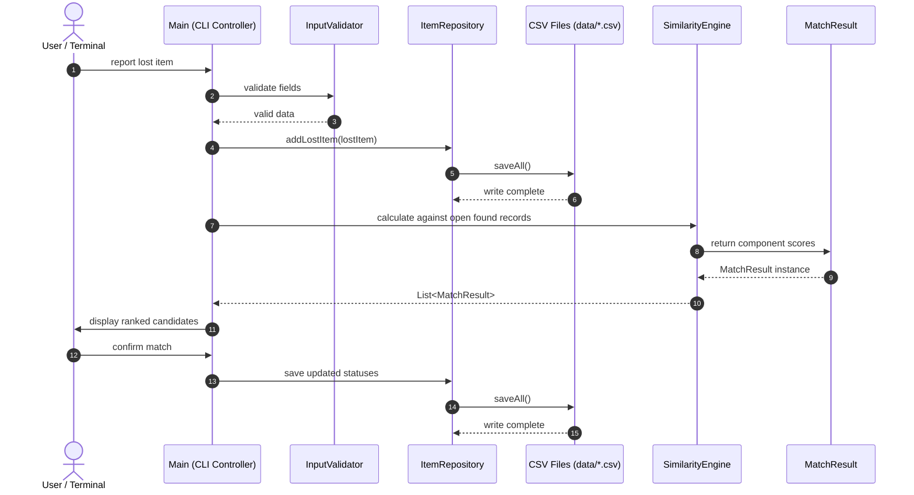

---

# ☕ Java Concepts Demonstrated

The project demonstrates practical Java concepts including:

## Object-Oriented Programming

* Classes and objects
* Encapsulation
* Inheritance
* Abstraction
* Method overriding

## Collections

* `ArrayList`
* `List`
* Java Streams

## Enumerations

```java
ItemStatus
```

## Date and Time API

```java
LocalDate
DateTimeFormatter
ChronoUnit
```

## File Handling

* `File`
* `FileReader`
* `FileWriter`
* `BufferedReader`
* `PrintWriter`
* `Files`
* `Paths`

## Exception Handling

The application handles:

* Invalid user input
* Invalid dates
* Invalid numeric values
* File I/O errors
* Malformed stored records

## Algorithms

* Levenshtein distance
* Jaccard similarity
* Weighted scoring
* Candidate ranking
* Tokenization
* Date-based scoring
* Hierarchical location matching

---

# 📋 Evaluation Checklist

| Requirement                   | Implementation                                       |
| ----------------------------- | ---------------------------------------------------- |
| Meaningful real-world problem | Campus lost-and-found matching                       |
| Java-based implementation     | Pure Java SE                                         |
| Command-line execution        | Supported                                            |
| Multiple functional modules   | Reporting, matching, search, confirmation, analytics |
| Object-oriented design        | Model hierarchy and modular classes                  |
| Algorithmic component         | Multi-dimensional similarity engine                  |
| Persistent storage            | CSV repository                                       |
| Input validation              | `InputValidator`                                     |
| Error handling                | Defensive input and file handling                    |
| Modular architecture          | Presentation / Model / Matcher / Repository          |
| Testing support               | `test/` directory                                    |
| Documentation                 | README + `statement.md`                              |
| Version control               | Git/GitHub compatible                                |

---
# 🗃️ Data Model

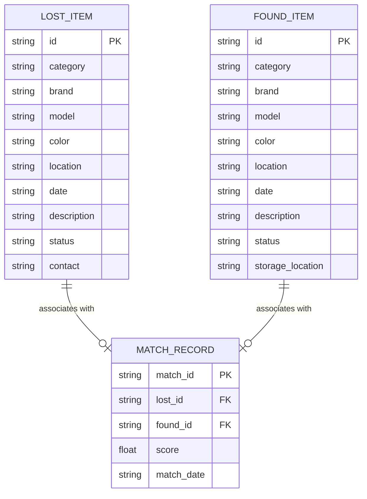
---

# 🔮 Future Enhancements

Potential future versions of IntelliFind could include:

* Graphical user interface
* Web-based interface
* Relational database integration
* User authentication
* Image-based item similarity
* Advanced natural-language processing
* Geographic distance calculation using coordinates
* Email/SMS notifications
* Administrative dashboard
* Multi-campus support
* REST API integration
* Advanced ranking algorithms
* Duplicate report detection
* Automatic resolution recommendations

These features are outside the current CLI-focused implementation but provide possible directions for future development.

---

# 🧮 Original Algorithmic Implementation

The core matching logic is implemented specifically for IntelliFind using standard Java APIs.

The system does not depend on external AI services or third-party matching APIs.

The primary algorithmic pipeline is:

```text
Levenshtein Similarity
        +
Jaccard Similarity
        +
Hierarchical Location Matching
        +
Date Proximity Scoring
        +
Weighted Composite Scoring
        ↓
Ranked Match Recommendations
```

---

# 🏁 Conclusion

**IntelliFind** transforms a conventional lost-and-found record system into an explainable matching system.

Instead of requiring users to manually inspect every record, the application:

```text
Collect Data
     ↓
Validate Records
     ↓
Store Information
     ↓
Compare Lost & Found Items
     ↓
Calculate Multi-Dimensional Similarity
     ↓
Rank Potential Matches
     ↓
Explain Match Evidence
     ↓
Allow Human Verification
     ↓
Confirm Resolution
```

The result is a lightweight, modular Java application demonstrating practical applications of:

* Object-oriented programming
* File handling
* String algorithms
* Date processing
* Collections
* Input validation
* Exception handling
* Software architecture
* Similarity matching

in a real-world campus lost-and-found problem domain.

---
